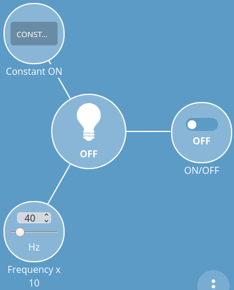

# Web Thing – Blinking Led

## Introduction

This is web connected blinking led.

## Dependencies

Requires:

 * [Web Thing Server](https://github.com/KrzysztofZurek1973/web_thing_server).

## Features

Blinking led has @type „Light” and following parameters:

* property `led_on`, turns on/off blinking, @type *OnOffProperty*
* property `frequency`, frequency of blinking in 0.1 Hz (number 10 means 1 Hz), @type *LevelProperty*
* action `constant_on`, turn led on for specified period of time, the only one input is *duration* in seconds, @type `ToggleAction`

## Documentation

How to start the node see [iot_web_thing_example](https://github.com/KrzysztofZurek1973/iot_web_thing_example#power-up).

### Configuration

GPIO number can be set in `idf.py menuconfig -> Web Thing Example` (see [iot_web_thing_example](https://github.com/KrzysztofZurek1973/iot_web_thing_example)).

Default led pin is GPIO26.

### Gateway web interface

### Scheme

## Source Code

The source is available from [GitHub](https://github.com/KrzysztofZurek1973/iot_components.git).

## License

The code in this project is licensed under the MIT license - see LICENSE for details.

## Authors

* **Krzysztof Zurek** - [kz](https://github.com/KrzysztofZurek1973)

