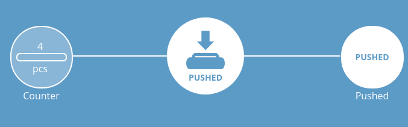

# IoT Thing: Push button

## Introduction

This is web connected push button.

## Dependencies

Requires:

 * [Web Thing Server](https://github.com/KrzysztofZurek1973/iot_components/tree/master/web_thing_server)

## Features

Push button has @type `PushButton` and following parameters:

* property `pushed`, indicates if button is pushed, @type `PushedProperty`
* property `counter`, shows how many times button was pressed, @type `LevelProperty`
* event `10times`, event notification sent when button was pushed 10 times, @type `AlarmEvent`

## Documentation

How to start the node see [iot_web_thing_example](https://github.com/KrzysztofZurek1973/iot_web_thing_example#power-up).

### Configuration

GPIO number can be set in `idf.py menuconfig -> Web Thing Example` (see [iot_web_thing_example](https://github.com/KrzysztofZurek1973/iot_web_thing_example)).

Default button pin is GPIO22.

### Gateway web interface

### Scheme

## Source Code

The source is available from [GitHub](https://github.com/KrzysztofZurek1973/iot_components/tree/master/thing_button).

## License

The code in this project is licensed under the MIT license - see LICENSE for details.

## Authors

* **Krzysztof Zurek** - [kz](https://github.com/KrzysztofZurek1973)

