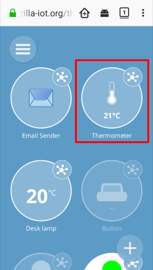
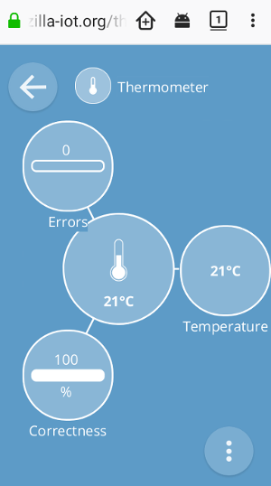

# IoT Thing: Thermometer

## Introduction

This is a ESP32-compatible C component for Web Thing Server.

Thermometer uses DS18B20 1-wire sensor for temperature reading.

## Dependencies

Requires:

 * [esp32-owb](https://github.com/DavidAntliff/esp32-owb).
 * [esp32-ds18b20](https://github.com/DavidAntliff/esp32-ds18b20)
 * [web thing server](https://github.com/KrzysztofZurek1973/iot_components/tree/master/web_thing_server)

## Example

See [iot_esp32_thermometer](https://github.com/KrzysztofZurek1973/iot_esp32_thermometer)

## Features

Thermometer thing has @type `TemperatureSensor` and the following properties:

* temperature:
	- @type = `TemperatureProperty`
	- type = `NUMBER`
	- maximum value = 125.0
	- minimu value = -55.0
	- unit = `degree celsius`
	- read only = `TRUE`
* errors: cumulated error number
* correctness: percentage of correct temperature readings in the last measurement (5 readings)

Pictures below show Gateway Web Interface for this thing.

## Description

Temperature sensor DS18B20, used in thermometer, has accuracy 0.5 C deg and range -55 .. 125 C deg. Communication between the sensor and ESP32 takes place over a 1-wire interface. 1-wire interface support is provided by software written by David Antliff [github](https://github.com/DavidAntliff/esp32-owb).

It has been assumed that only one temperature sensor is connected to the node. More sensors require changes to the functions `init_ds18b20` and `thermometer_fun`  (`thing_thermometer.c`).

The temperature is read every 1 second (`DS18B20_SAMPLE_PERIOD = 1000`). Every 5  correct readings the everage value is calculated and this result is sent to the clients. When CRC from DS18B20 is incorrect this measurement is treated as error (reading is incorrect) and it increments the `errors` value. Incorrect measurement also affects the `correctness` property. For example if 1 reading is incorrect then the correctness = 5/6 x 100% = 83%.

## Source Code

The source is available from [source code - github](https://github.com/KrzysztofZurek1973/iot_components).

## License

The code in this project is licensed under the MIT license - see LICENSE for details.

## Links

* [Maxim DS18B20](https://datasheets.maximintegrated.com/en/ds/DS18B20.pdf) - DS18B20 documentation
* [Maxim 1-wire](https://www.maximintegrated.com/en/design/technical-documents/tutorials/1/1796.html) - 1-wire documentation
* [WebThing Gateway](https://iot.mozilla.org/gateway/) - mozilla gateway web page
* [Web Thing API](https://iot.mozilla.org/wot/) - Web Thing API web page
* [esp-idf](https://github.com/espressif/esp-idf) - software for ESP32 microcontrollers
 * [esp32-owb](https://github.com/DavidAntliff/esp32-owb) - 1-wire software
 * [esp32-ds18b20](https://github.com/DavidAntliff/esp32-ds18b20) - DS18B20 software

## Authors

* **Krzysztof Zurek** - [kz](https://github.com/KrzysztofZurek1973)

