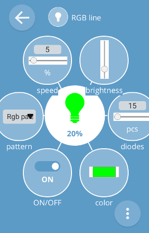
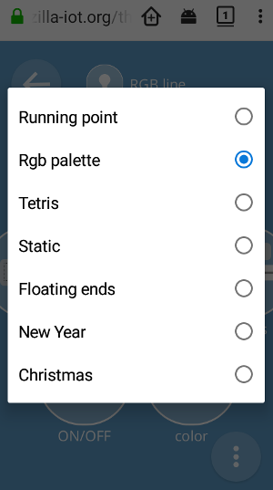

# IoT Thing: WS2812 RGB led line

## Introduction

This is a ESP32-compatible C component for **Web Thing Server**. This component controlls line of WS2812 (or WS2813) RGB leds.

## Dependencies

Requires:

 * [rgb patterns](https://github.com/KrzysztofZurek1973/RGB_led_line_patterns)
 * [Web Thing Server](https://github.com/KrzysztofZurek1973/iot_components/tree/master/web_thing_server)

## Example

See [rgb controller](https://github.com/KrzysztofZurek1973/iot_rgb_controller)

## Features

The controller has the following properties:
 
- `on` - ON/OFF led line
- `diodes` - number of diodes in the line
- `color` - RGB color defined for some patterns
- `speed` - pattern refreshment speed, 0 .. 100
- `brgh` - leds' brightness, 0 .. 100
- `pattern` - currently running pattern

Picture below shows the Gateway Web Interface for this thing.

Pattern list is implemented as `string enum` in json format. Picture below shows that list on Firefox Android.

## Description

### ON/OFF state

Property ON/OFF switches the state of the LED line between:

- `ON` - diodes are controlled by current pattern, the refresh rate is defined as a percentage of the maximum frequency for the given pattern (field `pattParam_t.freq_max`), e.g. for `running point` pattern `freq_max` = 30, for speed = 10 the change of moving diode is done 3 times per second (10% from 20 Hz is 3 Hz)
- `OFF` - `stand-by` pattern is chosen, two diodes with brightness of 1% move from the ends of the line to the center and back

### Data sent to LED line

Diodes are refreshed in the function `refreshRgb` ([thing_rgb_led_line.c](./thing_rgb_led_line.c)). The following steps are performed in this function:

- check whether the number of diodes has been changed
- chose the current pattern (`stand-by` for `OFF` state)
- run pattern function (calculate new RGB values)
- convert RGB format into WS2812 format for SPI interface
- send data to LED line by SPI interface

### Patterns initialization

Patterns are initialized in `initRgbPatterns` function (see [patterns.c](https://github.com/KrzysztofZurek1973/RGB_led_line_patterns/blob/master/patterns.c)).

Newly defined patterns must be added here and their names must be added to the  `prop_pattern.enum_list` list in the correct order (see function `init_rgb_led_line` in [thing_rgb_led_line.c](./thing_rgb_led_line.c)).

## Source Code

The source is available from [GitHub](https://github.com/KrzysztofZurek1973/iot_components/tree/master/thing_ws2812_controller).

## License

The code in this project is licensed under the MIT license - see LICENSE for details.

## Links

* [WebThing Gateway](https://iot.mozilla.org/gateway/) - https://iot.mozilla.org/gateway/
* [Web Thing API](https://iot.mozilla.org/wot/) - https://iot.mozilla.org/wot/
* [esp-idf](https://github.com/espressif/esp-idf) - https://github.com/espressif/esp-idf

## Authors

* **Krzysztof Zurek** - [kz](https://github.com/KrzysztofZurek1973)
