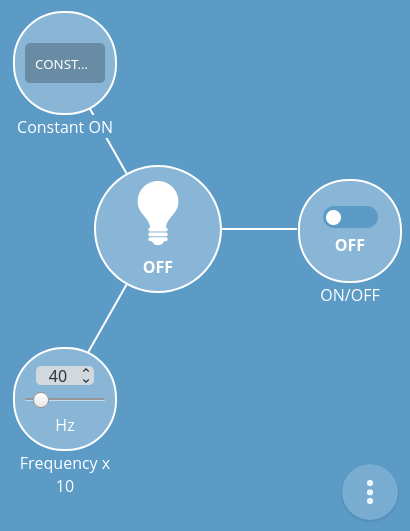

# Web Thing Server (WTS)

## Introduction

**Web Thing Server** is software for handling *things* in node (physical device with ESP32 microcontroller) according to the [Web Thing API](https://iot.mozilla.org/wot).

How to use WTS is discussed below using the example of [blinking led](https://github.com/KrzysztofZurek1973/iot_components/blob/master/thing_blinking_led/thing_blinking_led.c) and [push button](https://github.com/KrzysztofZurek1973/iot_components/tree/master/thing_button) as part of [iot_web_thing_example](https://github.com/KrzysztofZurek1973/iot_web_thing_example).

## How to use

For every *thing* the following functions must be defined:

* **set function** for writable properties,  function called when the value changes via gateway web interface (PUT for REST API, `setProperty` for WebSocket API)

see [blinking led](https://github.com/KrzysztofZurek1973/iot_components/blob/master/thing_blinking_led/thing_blinking_led.c): `int8_t led_set_on_off(char *new_value_str)`

* **run function** for every action, executed after calling the action via gateway web interface (POST for REST API, `requestAction` for WebSocket API)

see [blinking led](https://github.com/KrzysztofZurek1973/iot_components/blob/master/thing_blinking_led/thing_blinking_led.c): `int8_t constant_on_run(char *inputs)`

* **thread function** which can do the thing's logic, this is the task's function of freeRTOS task

see [blinking led](https://github.com/KrzysztofZurek1973/iot_components/blob/master/thing_blinking_led/thing_blinking_led.c): `void blinking_led_fun(void *param)`

and parameters such as id, @context (default is https://iot.mozilla.org/schemas), @type, description and json model length in bytes.
For every thing the properties and/or actions and/or events must be defined (at least one of them should be defined).

The use of **Web Thing Server** requires the following steps:

* initialize of the main server node
* create *things* along with properties, actions and events
* add *things* to the server
* start server
* start sntp client to have correct time needed by actions and events

### Initialization of the main server node

The first step to run WTS is initialization of the main server node. To do this, call the function

`root_node_init()`

### Create things

The function which creates *thing* should return thing pointer `thing_t *`. 

`thing_t *init_blinking_led(void)`

Creating things takes place in the following steps:

#### Step 1 – initialize empty thing structure

`blinking_led = thing_init();`

#### Step 2 – set thing parameters

`blinking_led -> id = "Led";` //thing ID

`blinking_led -> at_context = things_context;` //default is https://iot.mozilla.org/schemas

`blinking_led -> model_len = 1500;` //the estimated json model length in bytes, you can give a few kilobytes to start with

`blinking_led_type.at_type = "Light";` //define @type according to thing context

`blinking_led_type.next = NULL;` //next @type, NULL if there is no next @type

`set_thing_type(blinking_led, &blinking_led_type);` //set @type of the thing

`blinking_led -> description = "Internet connected blinking LED";` //thing description

#### Step 3 – create property

In the following lines On/Off property is created

`prop_led_on = property_init(NULL, NULL);` //initialize empty structure

`prop_led_on -> id = "led_on";` //property ID

`prop_led_on -> description = "led ON/OFF state";` //preperty description string

`prop_led_on_type.at_type = "OnOffProperty";` //define @type according to thing context

`prop_led_on_type.next = NULL;` //if there is no next @types set NULL

`prop_led_on -> at_type = &prop_led_on_type;` //set @type for property

`prop_led_on -> type = VAL_BOOLEAN;` //property type

`prop_led_on -> value = &led_is_on;` //on/off variable address

`prop_led_on -> title = "ON/OFF";` //title, displayed on the gateway web interface

`prop_led_on -> read_only = false;`

`prop_led_on -> set = led_set_on_off;` //set function

`prop_led_on -> mux = led_mux;` //mutex

Other possible property types are:

* `VAL_NUMBER`
* `VAL_INTEGER`
* `VAL_STRING`
* `VAL_ARRAY`
* `VAL_OBJECT`

Types *array* and *object*, require functions to create json model and json value (structure `property_t` in fields  `jsonize_t *value_jsonize` and `jsonize_t *model_jsonize` must contain function's address).

Typ `VAL_NULL` is not implemented yet!

#### Step 4 – add property to thing

`add_property(blinking_led, prop_led_on);` //add property to thing

#### Step 5 – create action (if thing has action(s))

`constant_on = action_init();` //initialize empty structure

`constant_on -> id = "constant_on";` //action ID

`constant_on -> title = "Constant ON";` //text visible on gateway web interface

`constant_on -> description = "Set led ON for some seconds";`

`constant_on -> run = constant_on_run;` //run function

`constant_on_input_attype.at_type = "ToggleAction";` //define action input @type 

`constant_on_input_attype.next = NULL;`

`constant_on -> input_at_type = &constant_on_input_attype;` //set action input @type

```
constant_on_duration = action_input_prop_init("duration",
						VAL_INTEGER, true,
						&constant_on_duration_min,
						&constant_on_duration_max,
						"seconds");
``` //initialize input property

`add_action_input_prop(constant_on, constant_on_duration);` //add input to action

#### Step 6 – Add action to thing

`add_action(blinking_led, constant_on);`

#### Step 7 – Create thing's thread

`xTaskCreate(&blinking_led_fun, "blinking led", configMINIMAL_STACK_SIZE * 4,
		NULL, 5, &blinking_led_task);`

### thread function

Thread function runs in infinite loop, it can do thing's logic or whatever is necessary.

see [blinking led](https://github.com/KrzysztofZurek1973/iot_components/blob/master/thing_blinking_led/thing_blinking_led.c): `void blinking_led_fun(void *param)`

If the value of the property parameter changes in this function (or anywhere else), websocket clients should be informed by calling

`inform_all_subscribers_prop(property_name);`

e.g. in the [button](https://github.com/KrzysztofZurek1973/iot_components/blob/master/thing_button/thing_button.c) thing, after pressing the button, you should inform clients that the button is pressed, this is done by

`inform_all_subscribers_prop(prop_pushed);`

The [button](https://github.com/KrzysztofZurek1973/iot_components/blob/master/thing_button/thing_button.c) thing also shows how to send information about the occurrence of the event (`emit_event`).

### set function – set property value

Set function is called when new property value is sent to server (to thing) from gateway web interface, it receives string representation of the new value.

For example when you tap blinking led circle on web interface (when it's off) set function receives message `”true”`.



This function should return 1 if value is set correctly, -1 otherwise. Client notification is done automatically.


For example see:

`int8_t led_set_on_off(char *new_value_str)`

in [blinking led](https://github.com/KrzysztofZurek1973/iot_components/blob/master/thing_blinking_led/thing_blinking_led.c)


### run function – execute action

This function is executed every time action is called from gateway web interface (button „SUBMIT QUERY” is pushed).


Input parameter of the function are action inputs in json format, e.g. for the above example it is `„duration”:10`.

Function is responsible for parsing the input correctly. When no errors occure function returns 0, otherwise -1 must be returned.

For example see

`int8_t constant_on_run(char *inputs)`

in [thing_button.c](https://github.com/KrzysztofZurek1973/iot_components/blob/master/thing_button/thing_button.c)

## Source Code

The source is available from [GitHub](https://github.com/KrzysztofZurek1973/iot_components/tree/master/web_thing_server).

## License

The code in this project is licensed under the MIT license - see LICENSE for details.

## Comments

1. Do to use spaces in json messages.

## Authors

* **Krzysztof Zurek** - [kz](https://github.com/KrzysztofZurek1973)
